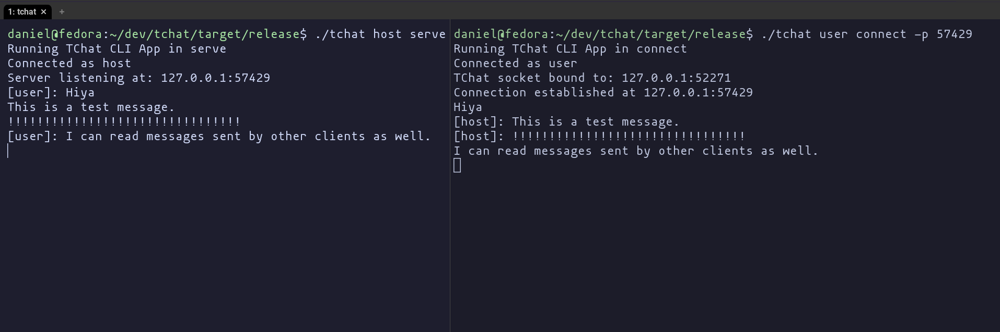

# TChat

A basic TCP Chat server written in Rust. It can handle multiple connections asynchronously.



## How to use

```
Usage: tchat [OPTIONS] <USERNAME> <COMMAND>

Commands:
  connect
  serve
  help     Print this message or the help of the given subcommand(s)

Arguments:
  <USERNAME>  The username that will be displayed to other clients

Options:
  -u          Whether the internet protocol should be UDP or TCP
  -h, --help  Print help
```

### Connect Flags

```
Options:
  -p <PORT>      The port of the target server [default: 0]
  -a <ADDR>      The IP address of the target server, defaults to localhost [default: 127.0.0.1]
  -h, --help     Print help
```

### Serve Flags

```
Options:
  -p <PORT>      The port of the target server [default: 0]
  -a <ADDR>      The IP address of the target server, defaults to localhost [default: 127.0.0.1]
  -h, --help     Print help
```
